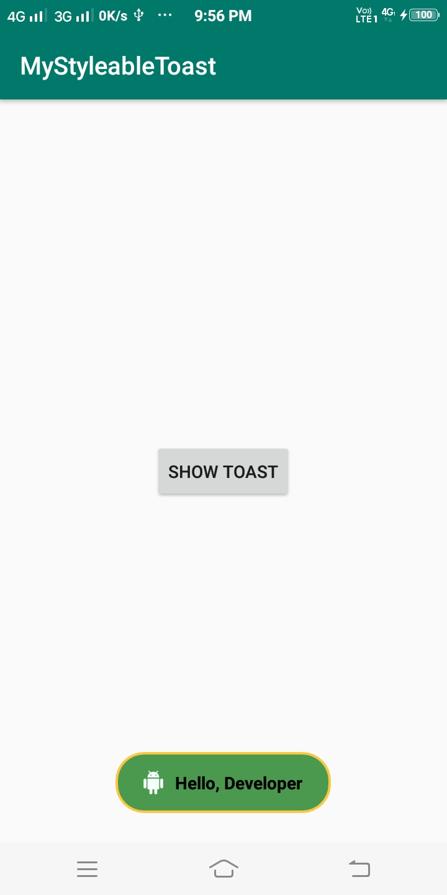

In this video we will take a look at the StyleableToast library, with which we can easily create toasts with customized attributes like background color, text color, borders, icons and more.
#MyStyleableToast

Watch Tutorial on -
[Youtube](https://youtu.be/Qbr8ykIff14)

Screenshot :

